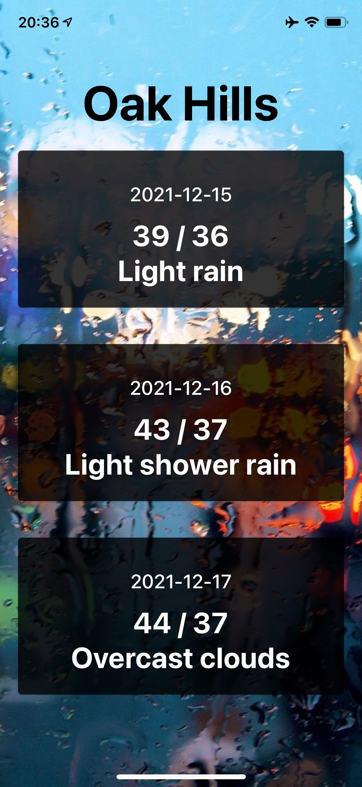

# weather

## Deployed: https://expo.dev/@tripppdx/weather

## Summary of Problem Domain

A mobile app that displays the three-day forecast for the user's current location. Determines geolocation using the device's GPS.

### Requirements - Lab: Class 41

Over the next 2 lab coding sessions, you will create your first Phone App. What it does and how it looks is up to you. This is an opportunity to play around with whats possible in React Native and to get a feel for how you can get into the various device features.

This is a 2-session assignment, after which you will live-demo your phone app to the class (at the start of class 43)

Lab/Coding Session #1 - Focus on getting your dev system up and operational, getting “proof of life” and reaching your MVP in terms of baseline functionality

Lab/Coding Session #2 - Add in the device features, polish, and prepare for deployments.

Requirements

- Use at least 1 native device feature (Contacts, Camera, GPS, etc)
- High Fidelity Styling and UX
- Good starting points:
- Native Base
- Builder X
- Properly Documented for End Users
- Live Demo & Presentation

### Image

